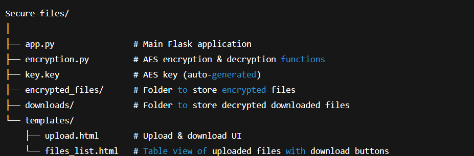
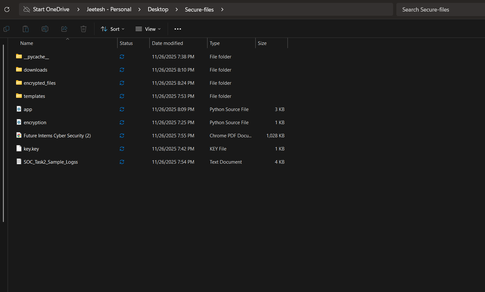
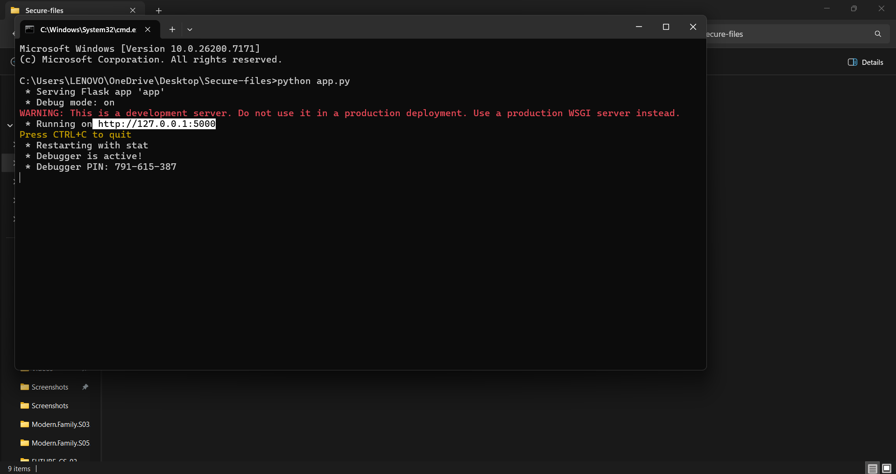
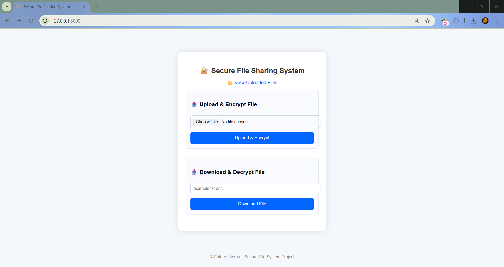
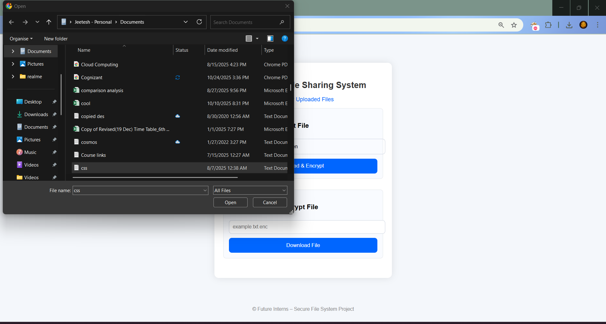
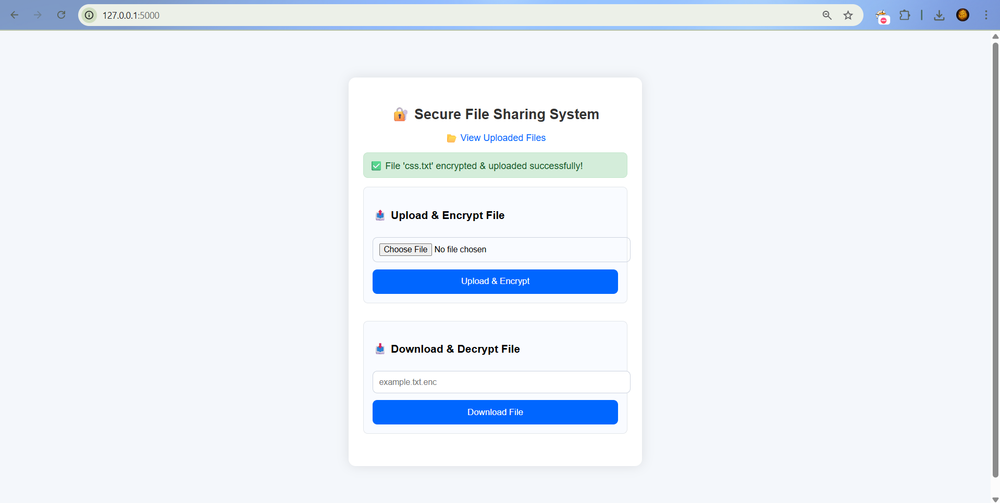
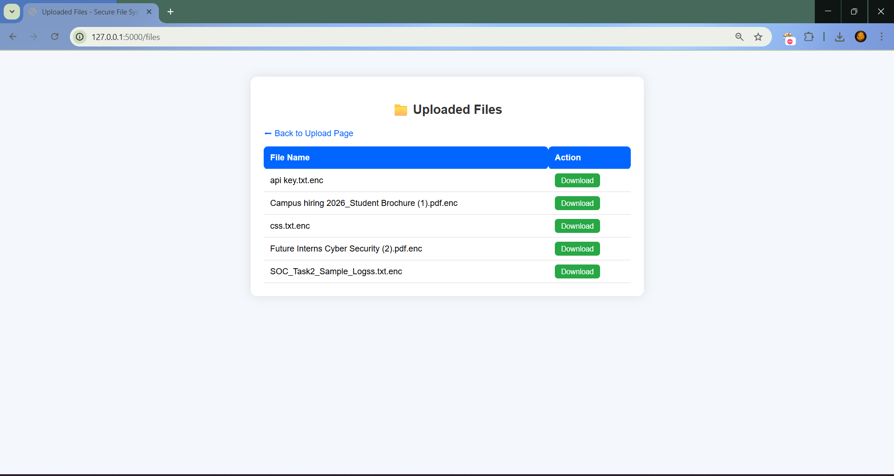
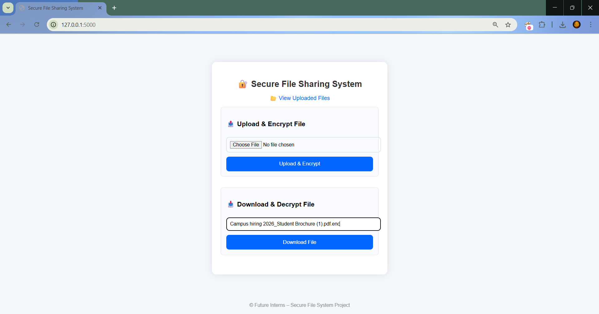
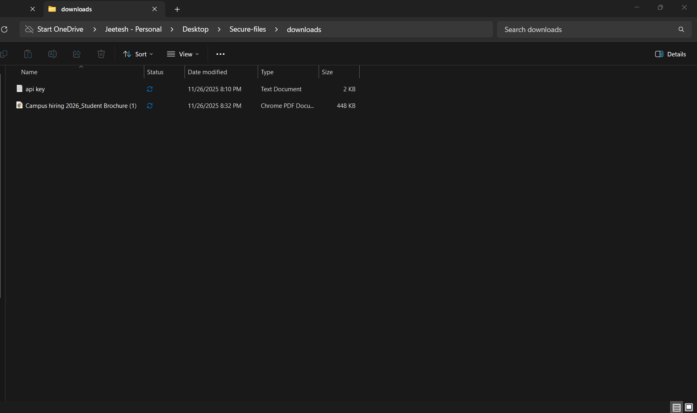

# 🚀 FUTURE_CS_03 – Secure File Sharing System

## 📌 Overview
This project implements a **Secure File Sharing System** using **Python Flask** and **AES encryption**. The system allows users to **upload and download files securely**, with encryption handled at rest and decryption on download.

This simulates real-world scenarios where secure data transfer is critical, such as **corporate, healthcare, or legal environments**.

---

## ✅ Key Features
- Secure **file upload and download** functionality  
- **AES-128 encryption** for all files at rest (EAX mode for confidentiality + integrity)  
- **Flash messages** to show upload/download status on the same page  
- Decrypted files saved in a dedicated **downloads/** folder  
- Encrypted files saved in **encrypted_files/** folder  
- **Files List Page** with download buttons  
- **Stylish, user-friendly interface** for easy navigation  
- Well-structured **project folder organization**  

---

## 🎯 Skills You’ll Gain
- Web development fundamentals (Flask backend + HTML/CSS frontend)  
- Implementing **AES encryption/decryption**  
- Flash messages & user-friendly interface design  
- Secure file handling & folder organization  
- Version control and GitHub repository management  

---

## 🛠️ Tools Used

| Tool / Library | Purpose |
|----------------|---------|
| Python 3.13 | Backend scripting |
| Flask | Web framework |
| PyCryptodome | AES encryption/decryption |
| HTML / CSS / JavaScript | Frontend UI |
| Git & GitHub | Version control |
| Browser (Chrome/Edge) | Testing & UI verification |

---

## 📁 Project Structure
- 
- 

---

## </> Terminal port enabling & UI
- The web works on `http://127.0.0.1:5000/`
- 
- UI
- 

## ⚙️ How It Works
1. **Upload & Encrypt**  
   - User selects a file → clicks **Upload & Encrypt**  
   - File is encrypted using **AES-128 EAX mode** and saved to `encrypted_files/`  
   - Success message shown on the same page
   - 
   - 
     
2. **Files List Page**  
   - Displays all uploaded files  
   - Provides download buttons for secure decryption
   - 

2. **Download & Decrypt**  
   - User clicks the download button  
   - File is decrypted and stored in `downloads/` folder  
   - Flash message confirms successful download
   - 
   - 
---

## 📝 Testing
- Upload single or multiple files → encrypted successfully  
- Download files → decrypted and saved in `downloads/`  
- Non-existent files → proper flash message shown  
- Files List Page displays all uploaded files with download option  

---

## 🧩 Key Learnings
- Flask backend & frontend integration  
- Implementing secure **AES encryption/decryption**  
- Flash messages for dynamic UI feedback  
- Folder management for encrypted and decrypted files  
- Project structuring for internship-ready GitHub repository   
---

## 🔑 Future Improvements
- Auto-delete decrypted files after download for added security  
- Implement **file size/type restrictions**  
- User authentication to restrict file access  
- Cloud storage integration for multi-user secure file sharing  

---

## 📦 Deliverables

Below are the final deliverables submitted for **Task 3 – Secure File Sharing System (AES-128 Encryption)**:

### **1️⃣ Source Code Files**
Attach the following project files:

- **`app.py`** – Main Flask backend  
- **`encryption.py`** – AES encryption/decryption logic  
- **`templates/upload.html`** – File upload UI  
- **`templates/files_list.html`** – File listing & download page   

---

### **2️⃣ Project Report (PDF / DOCX)**
- 
Project documentation covering:

- Aim & objective  
- Tools & technologies  
- Architecture  
- Screenshots  
- Workflow explanation  
- Testing & validation  
- Conclusion

---

